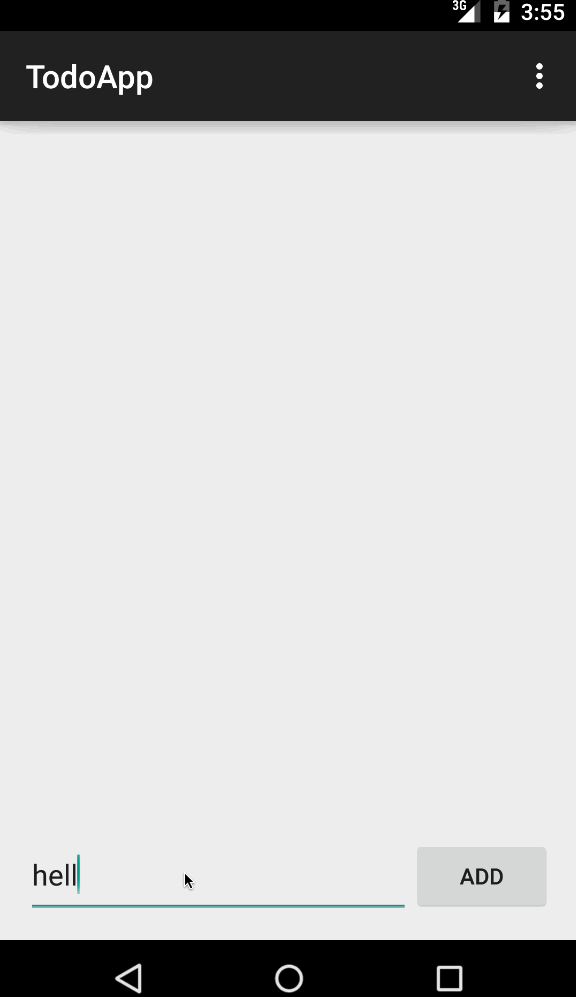

# [Android Bootcamp] Project 0

This is an Android demo application for displaying 

Time spent: 3 hours spent in total

Completed user stories:

 * [x] Required: Can you successfully add and remove items from the todo list within your app?
 * [x] Required: Did you include support for editing todo items as described above?
 * [x] Required: Does your app persist todo items and retrieve them properly on app restart?
 * [x] Required: Did you successfully push your code to github? Can you see the code on github?
 * [x] Required: Did you add a README which includes a GIF walkthrough of the app's functionality?
 * [x] Required: Did you create an issue on the repo and include /cc @codepathreview @codepath in the issue body?
 
Notes:

I plan to add more features soon.

Walkthrough of user stories:

GIF created with [LiceCap](http://www.cockos.com/licecap/).
